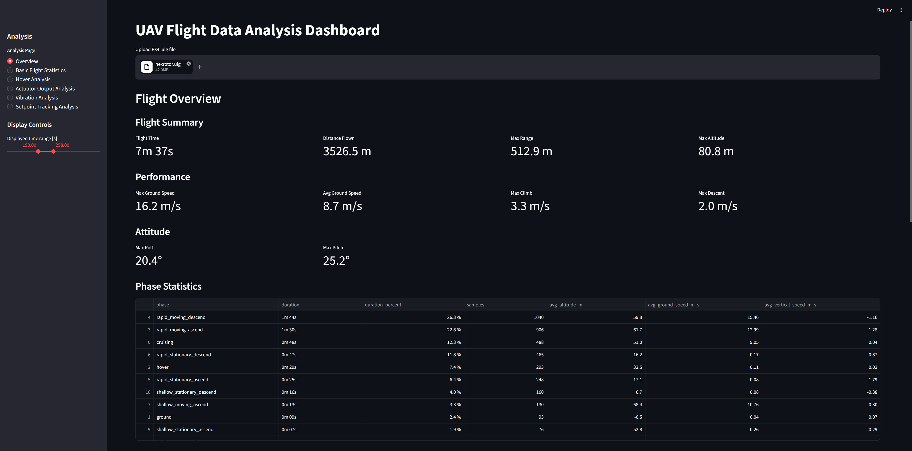
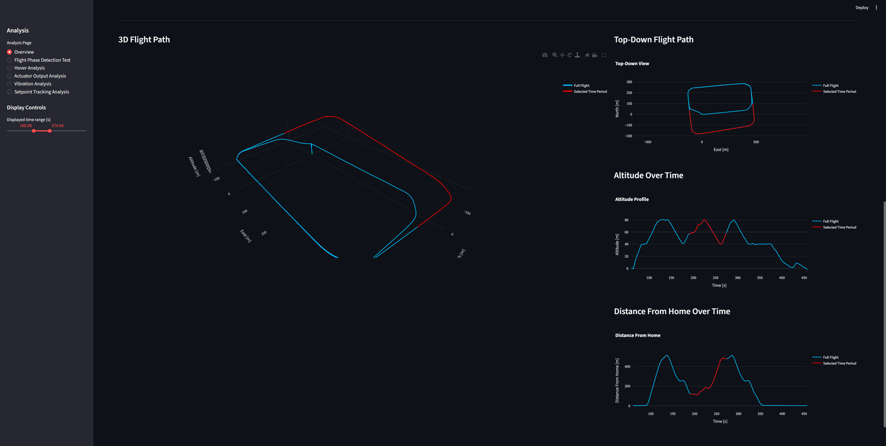
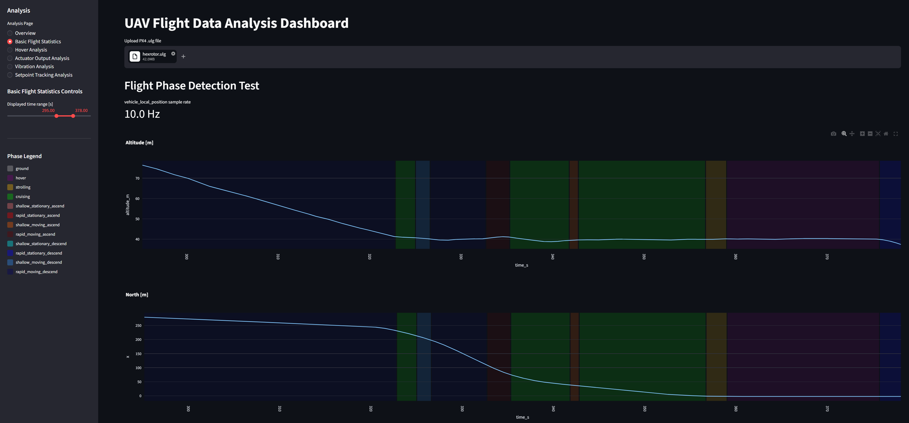
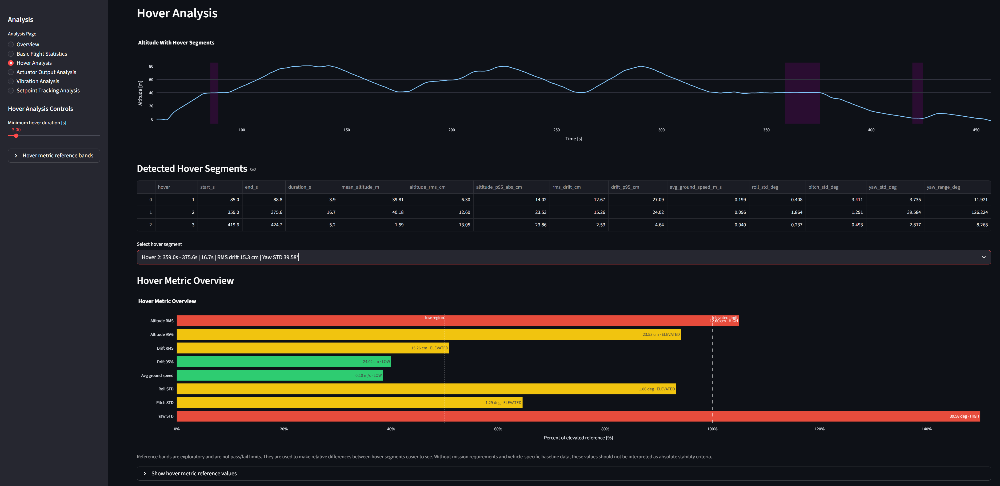
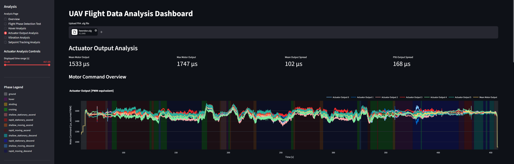
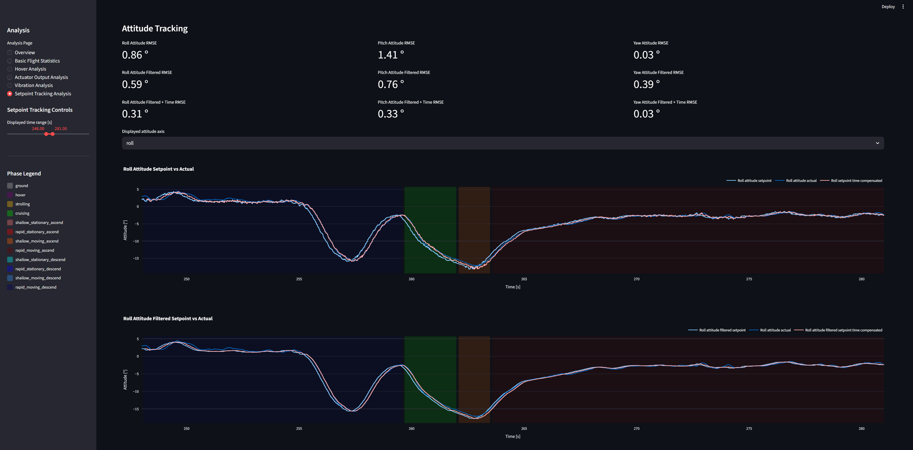
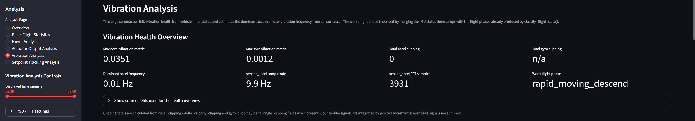
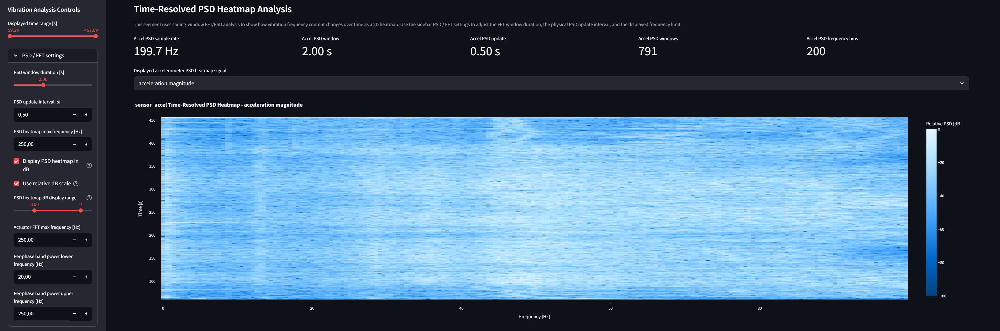

# PX4 UAV Flight Log Analysis Tool

An interactive Streamlit application for analyzing PX4 `.ulg` flight logs from UAV test flights.

## Project Description

This repository contains a Python-based flight data analysis dashboard. The tool imports PX4 ULog files, processes selected topics, calculates flight and control metrics, and visualizes the results through an interactive web interface.

The code is organized so that data loading, derived analysis functions, cached flight data, plotting logic, and utility functions are separated into different files.

## Purpose

The purpose of this dashboard is to support UAV flight test analysis.

The dashboard should help answer questions such as:

- What did the vehicle do during the flight?
- Which flight phases occurred?
- How stable was the vehicle during hover?
- How well did the vehicle follow rate, attitude, and trajectory setpoints?
- Were actuator outputs balanced or saturated?
- Are there signs of excessive vibration or IMU clipping?
- Do vibration frequencies correlate with actuator command frequencies?

The tool supports engineering judgment, but it does not replace manual validation, controlled testing, or vehicle-specific safety assessment.

## Main Features

Some analyses are only available when the corresponding PX4 ULog topics are present.

### Flight Overview
- Flight-specific statistics
- Flight path visualization




Further information available at [Overview Methodology](docs/methodology/overview.md)

### Basic Flight Statistics
- Position over time plots
- Velocity over time plots
- Flight phase classification



Further information available at [Basic Flight Statistics Methodology](docs/methodology/basic-flight-statistics.md)

### Hover Analysis
- Detection of hover segments
- Altitude stability metrics
- Horizontal drift metrics
- Roll, pitch, and yaw stability
- Hover reference bands for practical comparison



Further information available at [Hover Analysis Methodology](docs/methodology/hover-analysis.md)

### Actuator Output Analysis
- Motor output overview
- Mean motor output
- Motor output spread
- Motor pair analysis
- Vehicle rotational response
- Controller integrator status



Further information available at [Actuator Output Analysis Methodology](docs/methodology/actuator-output-analysis.md)

### Setpoint Tracking Analysis
- Rate tracking analysis
- Attitude tracking analysis
- Trajectory tracking analysis
- Tracking error metrics
- Optional low-pass filtered setpoint comparison
- Time-offset-compensated error metrics



Further information available at [Setpoint Tracking Analysis Methodology](docs/methodology/setpoint-tracking-analysis.md)

### Vibration Analysis
- IMU vibration health overview
- Acceleration and gyro vibration metrics
- Accel and gyro clipping counters
- Time-domain sensor_accel and sensor_gyro plots
- Time-resolved PSD heatmaps
- Actuator_controls FFT analysis
- Per-phase vibration table
- Exploratory actuator correlation plots




Further information available at [Vibration Analysis Methodology](docs/methodology/vibration-analysis.md)

## Repository Structure
```text
.
├── app.py                  # Streamlit user interface
├── analysis.py             # Analysis and signal-processing functions
├── flight_data.py          # Cached flight data access layer
├── ulg_reader.py           # PX4 ULog reader wrapper
├── phases.py               # Flight phase and plot colors
├── utils.py                # General helper functions
├── requirements.txt        # Python dependencies
├── README.md               # Project overview and setup guide
├── docs/                   # Documentation
│   └── screenshots/        # Dashboard screenshots
├── tests/                  # Future tests
└── data/                   # Local flight logs, not committed
```
## Installation and Setup

For Windows

Clone the repository:
```powershell
git clone https://github.com/florianbrunnbauer/uav-flight-data-analysis.git

cd .\uav-flight-data-analysis
```

Create a virtual environment:
```powershell
python -m venv .venv
```

Activate the virtual environment:
```powershell
.venv\Scripts\Activate.ps1
```

Install the dependencies:
```powershell
pip install -r requirements.txt
```

For Linux/macOS

Clone the repository:
```bash
git clone https://github.com/florianbrunnbauer/uav-flight-data-analysis.git

cd uav-flight-data-analysis
```

Create a virtual environment:
```bash
python -m venv .venv
```

Activate the virtual environment:
```bash
source .venv/bin/activate
```

Install the dependencies:
```bash
pip install -r requirements.txt
```

Tested with Python 3.13 on Windows 11.

## Requirements

- Python 3.13 or newer
- PX4 `.ulg` log files
- A local Python virtual environment is recommended

## Running the Dashboard

Start the app with:
```powershell
streamlit run app.py
```
After Streamlit starts, the displayed local URL should open, otherwise open it manually in your browser.

Upload a PX4 `.ulg` file through the file uploader in the dashboard.

## Example Workflow

1. Start the Streamlit dashboard.
2. Upload a PX4 `.ulg` file.
3. Review the overview page.
4. Inspect hover, actuator, setpoint tracking, and vibration pages.
5. Use the limitations section when interpreting possible causes.

## Data Handling

No real `.ulg` flight logs are part of this repository.

Flight logs are intentionally excluded because they may contain sensitive or project-specific information, including:

- Flight paths
- Timestamps
- Vehicle configuration
- Parameters
- Test behavior
- Location-related data

Local flight logs can be placed in the `data/` folder. This folder should be excluded from version control, for example through `.gitignore`.

## Limitations

This dashboard provides derived metrics and visual analysis tools, but it does not automatically determine the root cause of flight problems.

Important limitations:

- Actuator output plots show command behavior, not direct motor or propeller measurements.
- Actuator correlation plots show correlation only and do not prove causation.
- Vibration analysis depends on sensor sampling, log quality, FFT/PSD settings, and available PX4 topics.
- Flight phase classification is rule-based and may need adjustment for different vehicles or missions.
- Hover stability metrics depend on estimator quality and environmental conditions.
- Setpoint tracking metrics can be affected by delays, filtering, estimator behavior, and setpoint frequency.
- Some conclusions require additional information such as airframe geometry, motor layout, tuning parameters, sensor configuration, and ground truth data.

The tool is an engineering support dashboard, not an automatic pass/fail certification tool.

## Project Status

This project is under active development. Metrics, thresholds, and visualizations may change as the analysis methodology is refined.

## License

No license has been selected yet. Until a license is added, reuse and redistribution are not explicitly granted.