# Case Study: Public PX4 Hexrotor Log Analysis

This document presents one example analysis of a public PX4 ULog file using the UAV Flight Data Analysis Dashboard. The goal is to demonstrate the workflow, extracted metrics, visual checks, and limitations of the tool on a real flight log.

## Log Information

| Item | Value |
|---|---|
| Log source | PX4 Flight Review |
| Log type | Public log |
| Vehicle | Hexrotor / multicopter |
| File committed to repository | No |
| Analysis date | 2026.06.30 |
| Dashboard commit | `ea87df8404d312e74f25b5b2bbbebc3cb26f6030` |
| Python version | Python 3.13 |

The original `.ulg` file is not stored in this repository. Only screenshots and derived analysis results are documented.

## Analysis Settings

| Setting | Value |
|---|---|
| Time range | Full log unless stated otherwise |
| Flight phase debounce | 10 samples |
| Low-pass setpoint cutoff | 2.0 Hz |
| Tracking lag search window | ±0.5 s |
| PSD window duration | 0.5 s |
| PSD update interval | 2.0 s |
| PSD display scale | Relative dB |
| PSD max frequency | 250 Hz |

## Summary of Findings

| Area | Main observation | Confidence |
|---|---|---|
| Flight profile | Fast multicopter flight with climb, descent, cruise, and short hover-like segments | High |
| Hover quality | No clean stationary hover segment is available; the selected hover-like segment includes strong yaw rotation | High |
| Actuator behavior | Motor outputs show paired command behavior and notable output spread | Medium |
| Tracking | Roll attitude tracking improves after time compensation, suggesting measurable response delay | Medium |
| Vibration | No accelerometer clipping is detected; several spectral bands are visible, but the physical source cannot be identified | Medium |

## Flight Overview

### Key Results

| Metric | Value |
|---|---|
| Flight time | 7m 37s |
| Distance flown | 3526.5 m |
| Max altitude | 80.8 m |
| Max ground speed | 16.2 m/s |
| Max climb rate | 3.3 m/s |
| Max descent rate | 2.0 m/s |

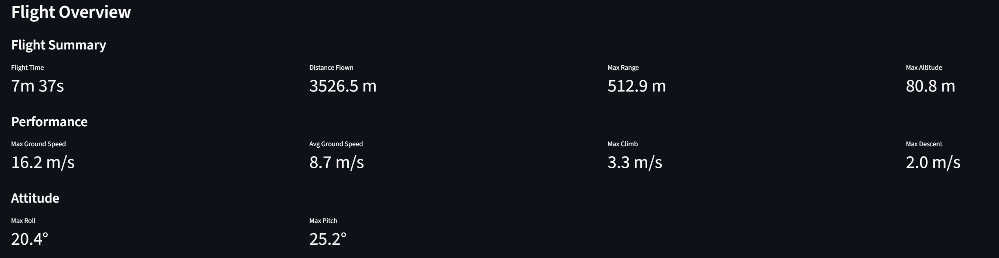

*Figure 1: The overview page summarizes the full flight path, altitude profile, distance from home, and basic flight-performance metrics.*

### Observations

- The log contains a full flight with takeoff, fast horizontal motion, altitude changes, and landing.
- The vehicle reaches a maximum altitude of 80.8 m and a maximum ground speed of 16.2 m/s.
- The calculated distance flown is 3526.5 m over a flight time of 7m 37s.

### Interpretation

The overview page gives a first description of the flight envelope: altitude range, horizontal movement, distance from home, and general motion intensity. The flight is not a short static hover test; it is a dynamic multicopter flight with considerable horizontal movement.

### Limitations

The overview metrics describe what happened during the flight, but they do not explain why the vehicle behaved that way. Mission intent, wind conditions, controller settings, and pilot or autonomous setpoint commands are required for deeper interpretation.

## Flight Phase Analysis

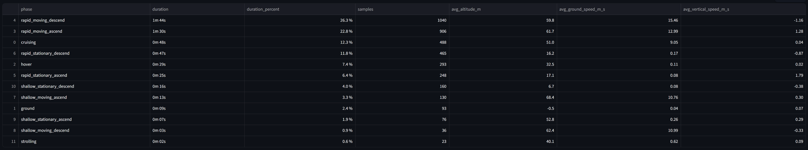

*Figure 2: The phase-statistics table summarizes how much time the vehicle spent in each rule-based flight phase.*

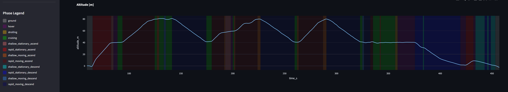

*Figure 3: The phase-colored time plots show how altitude and movement states change throughout the selected time range.*

### Observations

- The detected main phases include `rapid_moving_descend`, `rapid_moving_ascend`, `cruising`, `rapid_stationary_descend`, `hover`, and `rapid_stationary_ascend`.
- Most flight time is spent in `rapid_moving_descend`.
- Ground phases are visible at the beginning and end of the log.

### Interpretation

The phase classification is useful for separating flight behavior before calculating hover, actuator, tracking, or vibration metrics. It helps prevent the analysis from mixing fundamentally different operating conditions, such as cruise, ascent, descent, and hover-like segments.

### Limitations

The phase logic is rule-based and may not match the actual mission intent. The classification depends on selected velocity and altitude thresholds, so borderline cases or unusual mission profiles may be mislabeled.

## Hover Analysis

Selected detected hover-like segment: `Hover 2`, from `359.0 s` to `375.6 s`.

| Metric | Value |
|---|---|
| Duration | 0m 16s |
| Mean altitude | 40.18 m |
| Altitude RMS | 12.64 cm |
| RMS drift | 15.26 cm |
| Drift 95% | 24.02 cm |
| Roll STD | 1.864° |
| Pitch STD | 1.291° |
| Yaw STD | 39.584° |

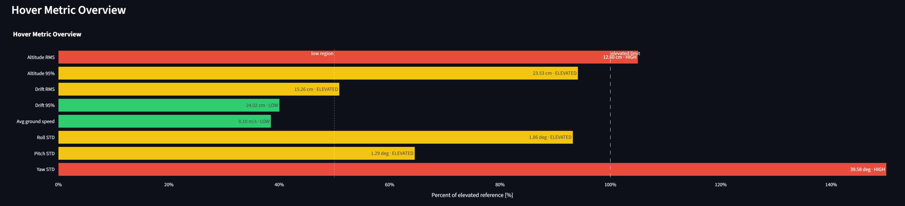

*Figure 4: The hover metric overview shows that the selected hover-like segment has moderate position scatter but strongly elevated yaw variation.*

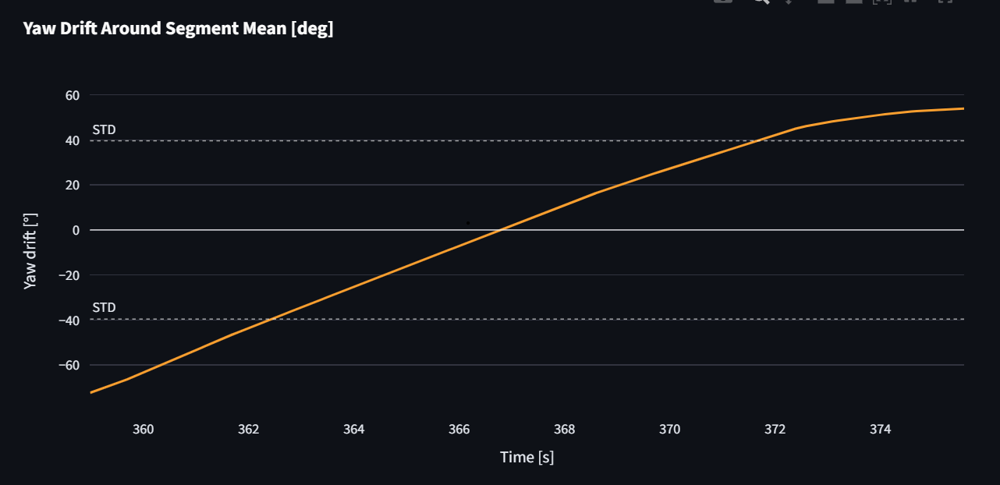

*Figure 5: The yaw-drift plot shows continuous heading change during the selected segment, which indicates that this is not a clean stationary hover.*

### Observations

- The selected segment lasts approximately 16 s and has a mean altitude of 40.18 m.
- The altitude RMS is 12.64 cm and the horizontal RMS drift is 15.26 cm.
- The yaw standard deviation is 39.584°, which is much larger than the roll and pitch standard deviations.
- The yaw-drift plot shows that the vehicle rotates during the selected segment.

### Interpretation

This segment is useful for demonstrating how the hover-analysis page identifies potentially problematic hover-like segments. The horizontal and vertical position metrics are still informative, but the large yaw variation indicates that the vehicle is not holding a fixed heading. Therefore, this segment should not be used as a reliable hover-quality benchmark.

### Limitations

The public log does not provide mission requirements, wind conditions, positioning quality, vehicle-specific acceptance limits, or the intended hover behavior. Because no cleaner hover segment is available in this log, the selected segment is interpreted comparatively rather than as a pass/fail hover-stability result.

## Actuator Output Analysis

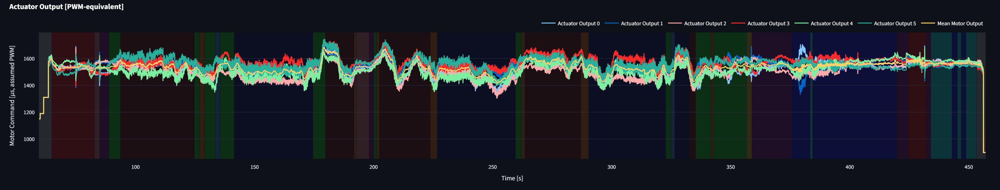

*Figure 6: The actuator-output plot shows the active motor command channels, the mean motor command, and the spread between motor outputs over time.*

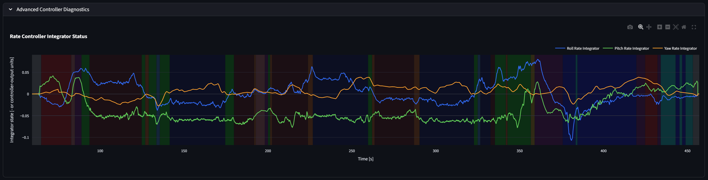

*Figure 7: The controller-integrator plot can reveal sustained correction effort, but it cannot identify the physical cause of that effort by itself.*

### Key Results

| Metric | Value |
|---|---|
| Mean motor output | 1533 µs, PWM-equivalent |
| Max motor output | 1747 µs, PWM-equivalent |
| Mean output spread | 102 µs |
| P95 output spread | 168 µs |

| Pair | Motor 1 | Motor 2 |
|---|---|---|
| Pair 1 | Output 0 | Output 1 |
| Pair 2 | Output 2 | Output 3 |
| Pair 3 | Output 4 | Output 5 |

### Observations

- Six active actuator-output channels are visible, which is consistent with a hexrotor-style motor configuration.
- The mean motor output is 1533 µs PWM-equivalent, and the maximum observed motor output is 1747 µs PWM-equivalent.
- The mean output spread is 102 µs, with a P95 output spread of 168 µs.
- The selected outputs show paired command behavior.
- The controller-integrator plot shows minimal sustained correction effort in the selected view.

### Interpretation

The actuator output page shows how motor command signals change over time and whether the commanded outputs are balanced or widely spread. The selected output pairs should be treated as candidate command pairs. Without the physical motor layout, they should not be interpreted as confirmed opposite-side motor pairs.

The rate-controller integrator plot can reveal sustained correction effort. Persistent non-zero integrator values may indicate that the controller is compensating for a bias or disturbance, but they do not identify the physical cause by themselves. In this selected view, the observed correction effort appears limited.

### Limitations

A clean hover segment would be preferable for assessing motor balance, because cruise, climb, descent, and yaw motion naturally require different motor commands. This log does not contain a clearly suitable stationary hover segment. The analysis can indicate periods of high control effort, but it cannot prove motor imbalance, propeller damage, or controller tuning problems without airframe geometry, motor mapping, and additional measurements.

## Setpoint Tracking Analysis

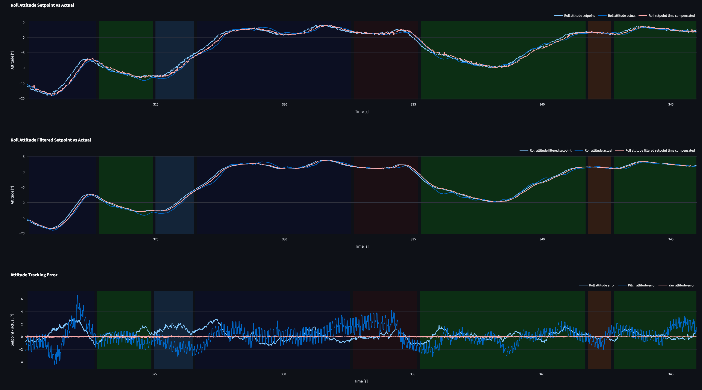

*Figure 8: The setpoint-tracking page compares measured response with the original, filtered, and time-compensated setpoint signals for the selected time range.*

The selected time frame ranges from 320 s to 346 s.

### Attitude Tracking: Roll Axis

| Axis | MAE | RMSE | P95 abs | Time offset |
|---|---:|---:|---:|---:|
| Roll | 0.664° | 0.883° | 1.911° | 0.000 s |
| Roll time compensated | 0.433° | 0.547° | 1.111° | 0.175 s |
| Roll filtered | 0.518° | 0.667° | 1.391° | 0.000 s |
| Roll filtered & time compensated | 0.421° | 0.535° | 1.112° | 0.095 s |

### Observations

- The selected example focuses on roll-axis attitude tracking.
- The estimated time offset is 0.175 s for the unfiltered roll setpoint and 0.095 s for the filtered roll setpoint.
- The roll MAE decreases from 0.664° to 0.433° after time compensation, which corresponds to an improvement of approximately 35%.
- The filtered and time-compensated roll case has the lowest MAE in this selected table.

### Interpretation

The tracking analysis compares setpoints against measured response. The time-offset-compensated metrics help separate apparent error caused by delay from error caused by the vehicle not reaching the commanded state. In this selected roll-axis example, part of the apparent tracking error is consistent with response delay.

### Limitations

The remaining error cannot be attributed to a single cause from this plot alone. Possible contributors include controller behavior, estimator delay, wind, setpoint frequency, attitude dynamics, filtering, or measurement uncertainty. The page can support controller assessment, but reliable conclusions require defined test scenarios and known operating conditions.

## Vibration Analysis

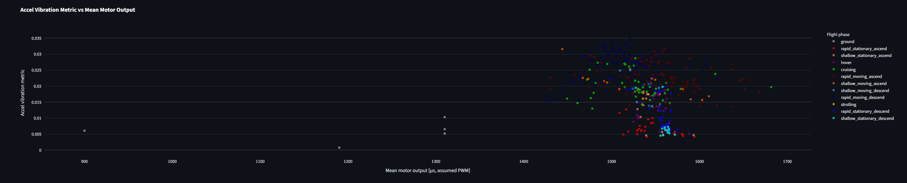

*Figure 9: The actuator-correlation scatter plot compares acceleration vibration metric values with mean motor output. This shows correlation only and does not prove causality.*

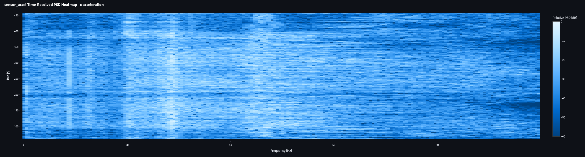

*Figure 10: The PSD heatmap shows time-resolved acceleration frequency content. Repeated bands are visible across portions of the flight.*

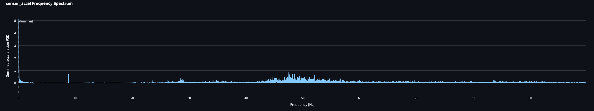

*Figure 11: The acceleration FFT summarizes frequency content over the selected window and supports the presence of repeated spectral peaks.*

### Key Results

| Metric | Value |
|---|---|
| Max accel vibration metric | 0.0351 |
| Max gyro vibration metric | 0.00120 |
| Total accel clipping | 0 |
| Total gyro clipping | n/a |
| Global dominant accel frequency | 0.01 Hz |
| Dominant vibration bands visually observed | ~10 Hz, ~20 Hz, ~30 Hz, ~50 Hz |
| Worst vibration phase | rapid moving descend |

### Observations

- No acceleration clipping events are detected.
- The gyro clipping counter cannot be read from the available fields.
- The global dominant acceleration frequency is 0.01 Hz.
- The PSD heatmap and FFT show repeated spectral content around approximately 10, 20, 30, and 50 Hz.
- The worst vibration phase reported by the dashboard is `rapid_moving_descend`.

### Interpretation

The global PSD maximum occurs at very low frequency and should not be interpreted as the main vibration frequency. For vibration assessment, the higher-frequency bands are more relevant. The repeated spectral content around approximately 10, 20, 30, and 50 Hz suggests persistent vibration components during parts of the flight.

The absence of acceleration clipping is positive because no accelerometer saturation events are detected in the available clipping counter. However, the vibration metric still needs to be compared against reference values or vehicle-specific baseline data before judging the vibration intensity.

### Limitations

The physical source of the observed spectral bands cannot be identified without motor speed, propeller geometry, airframe layout, motor mapping, sensor configuration, and controlled test conditions. The actuator-correlation plot shows correlation only and does not prove causality.

## Conclusion

This case study demonstrates that the dashboard can structure a PX4 log analysis into flight overview, phase detection, hover stability, actuator behavior, setpoint tracking, and vibration analysis.

The analysis provides useful engineering indicators. However, the results do not prove physical root causes by themselves. Reliable diagnosis would require additional information such as airframe geometry, motor layout, controller parameters, sensor configuration, environmental conditions, and mission intent.
