# Actuator Output Analysis Page Methodology

## Page intent

The **Actuator Output Analysis** page is a focused inspection page for actuator-command behavior and the resulting vehicle response in a PX4 `.ulg` flight log. Its purpose is to help identify time windows where motor commands, motor-output spread, body rates, attitude, acceleration, or rate-controller integrator states show unusual behavior.

This page answers the following questions:

- Which actuator output channels appear active in the log?
- How high is the mean motor output during the selected time range?
- How large is the spread between the minimum and maximum active motor outputs?
- Do motor commands increase during climb, descent, or high-demand maneuvers?
- Do motor-output changes align with roll, pitch, yaw rate, attitude motion, or acceleration?
- Do specific user-defined motor pairs show common or differential command behavior?
- Do actuator statistics differ between detected flight phases?
- Are the rate-controller integrator states growing, changing sign, or remaining biased during a maneuver?

The page is designed for **actuator-demand and response screening**. It can help find suspicious intervals, but it does not prove the physical cause of the behavior by itself. For example, high motor-output spread may be caused by commanded maneuvering, wind, geometry, imbalance, tuning, saturation, estimator behavior, or a combination of several effects.

## Required PX4 ULog topics

### `actuator_outputs`

This is the primary topic for the page. It is required for motor command plots, motor summary metrics, motor-output spread, phase-based actuator statistics, and user-defined motor-pair analysis.

Required fields:

- `timestamp`
- at least one active actuator output column such as `output[0]`, `output[1]`, ...

The implementation scans possible output channels from `output[0]` to `output[15]`. A channel is treated as active when it contains finite, non-constant, positive values.

### `vehicle_local_position`

This topic is required for time-range limits, phase-background coloring, phase-based actuator statistics, and the acceleration plot.

Required fields:

- `timestamp`
- `x`
- `y`
- `z`
- `vx`
- `vy`
- `vz`
- `ax`
- `ay`
- `az`

The page uses the processed dataframe returned by `flight.position`. This dataframe already contains derived local-position signals and detected flight phases.

### `vehicle_angular_velocity`

This topic is required for the rotational-response plot.

Required fields:

- `timestamp`
- `xyz[0]`
- `xyz[1]`
- `xyz[2]`

The angular velocity values are converted from radians per second to degrees per second for dashboard readability.

### `vehicle_attitude`

This topic is required for the roll, pitch, and yaw attitude plots.

Required fields:

- `timestamp`
- `q[0]`
- `q[1]`
- `q[2]`
- `q[3]`

The quaternion is converted to Euler angles in degrees before plotting.

### `rate_ctrl_status`

This topic is required for the optional **Advanced Controller Diagnostics** expander.

Required fields used by the current page:

- `timestamp`
- `rollspeed_integ`
- `pitchspeed_integ`
- `yawspeed_integ`

These signals are controller integrator states, not measured body rates.

## Time base

For the full shared method, see [`methods/time-base.md`](../methods/time-base.md).

All displayed signals use the relative time column:

```text
time_s = (timestamp - log_start_timestamp) / 1e6
```

The sidebar time-range slider filters the actuator, position, attitude, angular-velocity, and integrator dataframes:

```text
selected rows = rows where selected_start_s <= time_s <= selected_end_s
```

The phase-background bands are generated from the selected `vehicle_local_position` interval, so the colored background always corresponds to the currently displayed time range.

## Signals shown on the page

### Summary cards

The top of the page shows four actuator summary metrics:

- Mean Motor Output
- Max Motor Output
- Mean Output Spread
- P95 Output Spread

These values are currently calculated from the full actuator-output dataframe, not recomputed only for the selected time range.

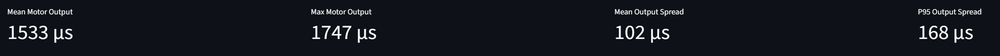

### Motor command overview

The motor command plot shows:

- each active `actuator_outputs` channel
- the mean motor output across all active channels
- detected flight-phase background coloring

The y-axis is labelled as motor command in microseconds with the note “assumed PWM”. This is a practical display convention. It should not be interpreted as verified physical PWM unless the vehicle and log schema confirm that the actuator output values represent PWM-equivalent commands.

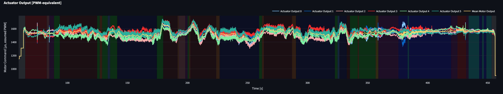

### Rotational response

The rotational-response plot shows body angular velocity:

- `roll_rate_deg_s`
- `pitch_rate_deg_s`
- `yaw_rate_deg_s`

These signals are derived from `vehicle_angular_velocity` by converting from radians per second to degrees per second.

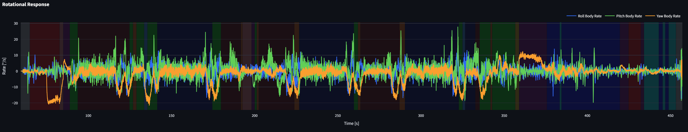

### Roll / Pitch attitude

This plot shows:

- `roll_deg`
- `pitch_deg`

The plot helps compare motor-output behavior against the vehicle attitude response.

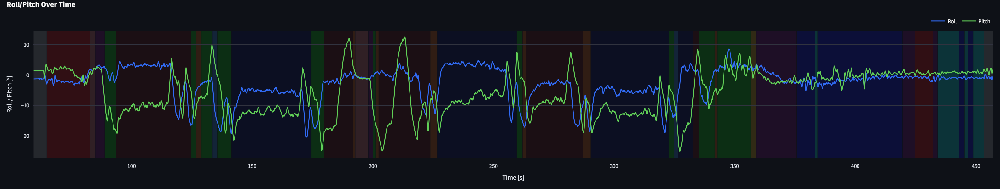

### Yaw attitude

This plot shows:

- `yaw_deg`

Yaw is plotted separately because its range and interpretation often differ from roll and pitch.

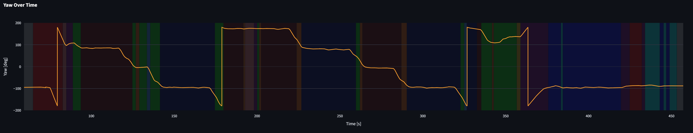

### Vehicle acceleration

The acceleration plot shows:

- `ax`: North acceleration
- `ay`: East acceleration
- `az_up_m_s2`: upward acceleration derived from `az`

The vertical acceleration sign convention is documented in [`methods/local-position-signals.md`](../methods/local-position-signals.md).

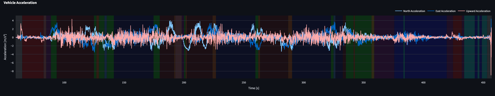

### Motor balance

The motor-balance plot shows:

- `motor_output_spread`
- a horizontal line at mean output spread
- a horizontal line at P95 output spread
- detected flight-phase background coloring

This plot is useful for identifying periods where one or more motors are commanded much higher or lower than the others.

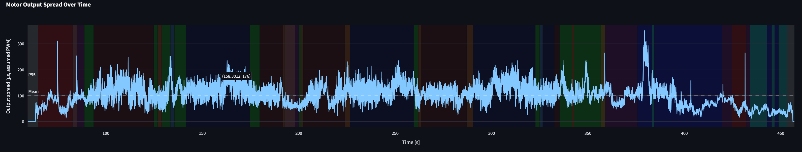

### Phase-based actuator statistics

The page assigns each actuator-output sample to the nearest detected flight phase using a nearest-time merge with the selected position dataframe. It then calculates per-phase actuator statistics for the selected time range:

- mean motor output
- max motor output
- mean output spread
- P95 output spread

These statistics make it easier to compare actuator demand across hover, climb, descent, cruise, or transition phases.

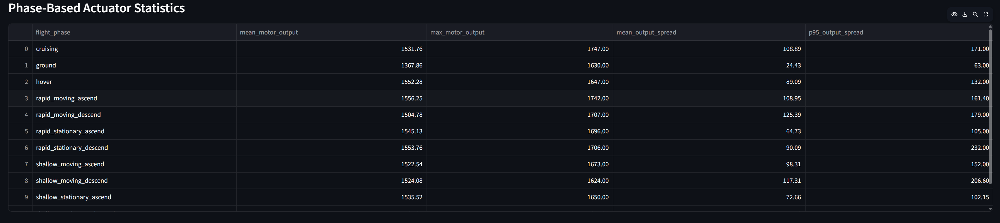

### User-defined motor pair analysis

The sidebar allows the user to define motor pairs from the active actuator output channels.

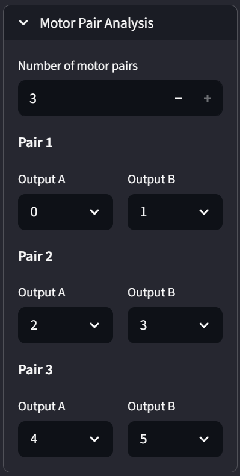

For each selected pair, the page shows:

- pair common output
- pair differential output

The pair analysis is exploratory. It does not prove physical motor placement or airframe geometry unless the selected output channels are known to correspond to actual opposite motors on the vehicle.

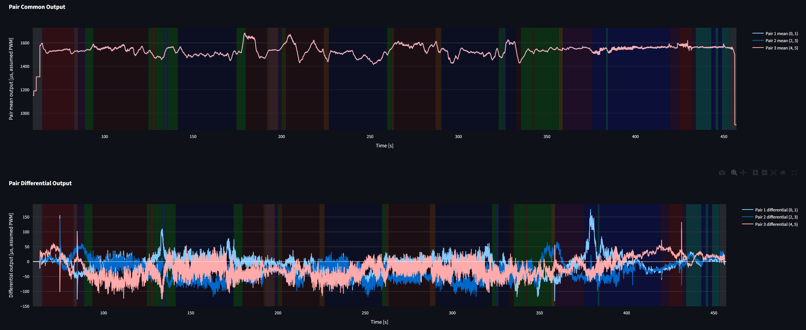

### Advanced controller diagnostics

Inside the **Advanced Controller Diagnostics** expander, the page shows rate-controller integrator states:

- `rollspeed_integ`
- `pitchspeed_integ`
- `yawspeed_integ`

These signals may help identify persistent controller effort or bias, but they are not direct proof of a mechanical problem.

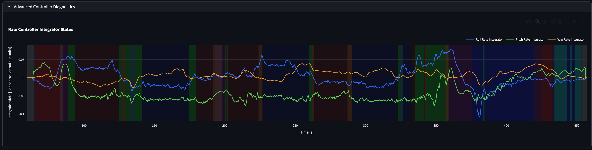

## Derived signals and formulas

### Active actuator output channels

The implementation scans output columns from `output[0]` to `output[15]`.

A channel is treated as active if:

```text
signal maximum > 0
signal standard deviation > 0
```

The resulting active output indices define which channels are used for motor metrics and plots.

### Mean motor output

For all active output channels:

```text
mean_motor_output = mean(active output channels)
```

This represents the common actuator-demand level across the active outputs.

### Minimum and maximum motor output

```text
min_motor_output = min(active output channels)
max_motor_output = max(active output channels)
```

These values describe the command envelope across the active outputs at each sample.

### Motor output spread

```text
motor_output_spread = max_motor_output - min_motor_output
```

This is the most important balance metric on the page. A larger spread means the controller is commanding a wider difference between active actuator outputs.

### Output rate

For each active actuator output channel:

```text
output_rate = diff(output) / diff(time_s)
```

The implementation also calculates:

```text
mean_abs_motor_output_rate = mean(abs(output_rate columns))
max_abs_motor_output_rate = max(abs(output_rate columns))
```

These rate metrics are currently calculated in the analysis layer but are not displayed as top-level plots on this page.

### Global actuator summary metrics

The summary dictionary includes:

```text
max_motor_output_spread = max(motor_output_spread)
mean_motor_output_spread = mean(motor_output_spread)
p95_motor_output_spread = 95th percentile of motor_output_spread
max_motor_output = max(max_motor_output)
mean_motor_output = mean(mean_motor_output)
mean_abs_motor_output_rate = mean(mean_abs_motor_output_rate)
p95_abs_motor_output_rate = 95th percentile of mean_abs_motor_output_rate
max_abs_motor_output_rate = max(max_abs_motor_output_rate)
```

Only a subset of these metrics is currently displayed as summary cards.

### Body-rate conversion

The body angular velocity topic stores rates in radians per second. The dashboard converts them to degrees per second:

```text
roll_rate_deg_s  = degrees(xyz[0])
pitch_rate_deg_s = degrees(xyz[1])
yaw_rate_deg_s   = degrees(xyz[2])
```

### Pair mean output

For a user-selected motor pair A/B:

```text
pair_mean_output = (output_A + output_B) / 2
```

This is the common command component of the selected pair.

### Pair difference

```text
pair_difference = output_A - output_B
```

This keeps the sign of the difference between the two selected outputs.

### Pair differential output

```text
pair_differential_output = (output_A - output_B) / 2
```

This is the opposite command component of the selected pair. It can be useful when the selected pair represents two motors that are physically opposite or otherwise meaningful for a specific airframe.

### Pair absolute differential output

```text
pair_abs_differential_output = abs(pair_differential_output)
```

This indicates the magnitude of pair imbalance without preserving sign.

## What can be analyzed with this page

The Actuator Output Analysis page is suitable for:

- identifying high actuator-demand intervals
- checking whether motor-output spread increases during certain maneuvers
- comparing motor-output behavior across flight phases
- inspecting whether rotational response aligns with actuator-output changes
- checking whether attitude excursions coincide with motor-output spread
- checking whether acceleration changes coincide with mean motor output or output spread
- exploring user-defined motor-pair behavior
- identifying possible integrator buildup or persistent controller bias
- selecting time windows for deeper setpoint tracking, vibration, or estimator analysis

Examples of useful observations:

- High mean motor output during climb is expected, but high output spread during steady hover may deserve further inspection.
- A persistent high differential output in a physically meaningful motor pair may indicate constant correction effort, but it does not prove a mechanical imbalance by itself.
- A high motor-output spread together with strong roll or pitch rates may simply reflect a commanded maneuver.
- A high motor-output spread without visible motion may indicate a disturbance, estimator issue, airframe asymmetry, or controller compensation.
- Integrator states that steadily grow or remain biased during a stable-looking segment may indicate persistent controller effort.

## Recommended workflow example

1. Upload the PX4 `.ulg` file and open the **Actuator Output Analysis** page.
2. Use the sidebar time-range slider to focus on the maneuver or flight phase of interest.
3. Check the summary cards to understand the general actuator-output level and spread.
4. Inspect the **Motor Command Overview** to see whether all active outputs behave plausibly.
5. Compare motor-output changes against the phase background.
6. Inspect **Rotational Response** to see whether output changes correspond to roll, pitch, or yaw rate.
7. Inspect roll, pitch, and yaw attitude plots to understand the vehicle orientation response.
8. Inspect the acceleration plot to see whether motor demand aligns with translational or vertical acceleration.
9. Check **Motor Balance** for periods of high output spread.
10. Review **Phase-Based Actuator Statistics** to compare actuator demand across detected phases.
11. Define motor pairs only if the selected outputs have a meaningful interpretation for the airframe.
12. Inspect pair common and differential output plots.
13. Open **Advanced Controller Diagnostics** if persistent offset or controller bias is suspected.
14. Use the identified time windows on related pages:
    - **Setpoint Tracking Analysis** to check whether the controller follows commands.
    - **Vibration Analysis** to check whether actuator demand coincides with vibration or clipping.
    - **Hover Analysis** to evaluate stability during hover intervals.

## Clear limitations

### The page is correlation-oriented, not causal

The page shows actuator commands and vehicle response signals in the same time window. It does not prove why the controller produced those commands. Causal interpretation requires airframe geometry, motor mapping, flight mode, controller settings, environmental context, and ideally controlled tests.

### Actuator output units are not guaranteed to be physical PWM

The page labels actuator outputs as microseconds with an “assumed PWM” note. This is a practical display convention based on common actuator-output values, but the exact meaning depends on the PX4 version, mixer/control allocation setup, output driver, and log schema.

### Active-output detection is heuristic

A channel is treated as active when it has positive non-constant values. This works for many logs but may misclassify channels if unused outputs contain noise, if active outputs are constant during a selected log, or if the output representation differs from the expected format.

### Motor-output spread is not the same as imbalance

A high spread means that the controller commanded different outputs. It does not automatically mean the airframe is mechanically imbalanced. It may be caused by normal maneuvering, wind, control allocation, yaw control, payload offset, geometry, tuning, or estimator behavior.

### User-defined motor pairs require airframe knowledge

The pair analysis is only meaningful if the selected outputs correspond to a physically meaningful pair. Without knowing motor numbering, rotation direction, arm geometry, and mixer/control allocation, pair differential output should be treated as exploratory.

### Summary cards are currently full-log metrics

The time-range slider filters the plots and the phase-based actuator table, but the top summary cards are based on the actuator metrics calculated before time filtering. Therefore, those cards should not be interpreted as selected-window-only metrics unless the implementation is later changed.

### Phase-based statistics depend on phase classification quality

The phase table uses nearest-time matching between actuator outputs and detected flight phases. If the phase classification is wrong, ambiguous, or poorly matched to the selected maneuver, the phase-based actuator statistics will also be misleading.

### Position-derived acceleration may be noisy

The acceleration plot uses `vehicle_local_position` acceleration fields. These are estimator-derived signals and may differ from raw IMU acceleration. They can be affected by estimator behavior, filtering, delay, or logging quality.

### Integrator interpretation requires controller knowledge

Rate-controller integrator states are useful indicators of persistent correction effort, but their scale and interpretation depend on controller implementation and tuning. They should not be interpreted as measured angular velocity or as direct proof of a fault.

### The page does not inspect saturation limits directly

The page shows observed actuator-output values and spread, but it does not compare them against configured PWM limits, motor model limits, battery voltage limits, thrust curves, or actuator saturation flags.

### Public logs may lack airframe and mission context

If the log comes from a public source or another operator, the motor mapping, airframe geometry, mission intent, payload, wind, tuning, and controller configuration may be unknown. In that case, conclusions should stay conservative and descriptive.