# Setpoint Tracking Analysis Page Methodology

## Page intent

The **Setpoint Tracking Analysis** page compares commanded setpoints with the measured vehicle response in a PX4 `.ulg` flight log. Its purpose is to screen controller-following behavior and to separate three related effects:

- raw tracking error between commanded and measured response
- tracking error after low-pass filtering the setpoint
- tracking error after time-offset compensation

The page answers the following questions:

- Does the vehicle follow body-rate setpoints in roll, pitch, and yaw?
- Does the vehicle follow attitude setpoints in roll, pitch, and yaw?
- Does the vehicle follow trajectory setpoints in position, altitude, velocity, and vertical speed?
- Are high tracking errors mainly caused by high-frequency setpoint content?
- Are high tracking errors partly explained by a measurable response delay?
- Do large body-rate errors occur together with high actuator-output spread?
- Which axes or signal groups show the largest bias, MAE, RMSE, P95 absolute error, or maximum absolute error?

The page is designed for **controller-performance screening**. It can identify suspicious time windows, axes, or operating conditions. It does not prove bad controller tuning, actuator saturation, mechanical imbalance, estimator error, or an airframe fault by itself.

## Required and optional PX4 ULog topics

### `vehicle_local_position`

This topic is required for the common time range, phase-background coloring, and trajectory tracking.

Required fields for the shared position dataframe:

- `timestamp`
- `x`
- `y`
- `z`
- `vx`
- `vy`
- `vz`

The page uses the processed dataframe returned by `flight.position`. This dataframe already contains derived local-position signals and detected flight phases.

### `vehicle_angular_velocity`

This topic is required for body-rate tracking.

Required fields:

- `timestamp`
- `xyz[0]`
- `xyz[1]`
- `xyz[2]`

The angular velocity values are converted from radians per second to degrees per second for dashboard readability.

### `vehicle_rates_setpoint`

This topic is required for body-rate setpoint tracking.

Required fields:

- `timestamp`
- `roll`
- `pitch`
- `yaw`

The roll, pitch, and yaw rate setpoints are converted from radians per second to degrees per second. If the topic or required fields are missing, the **Body-Rate Tracking** section is not shown.

### `vehicle_attitude`

This topic is required for attitude tracking.

Required fields:

- `timestamp`
- `q[0]`
- `q[1]`
- `q[2]`
- `q[3]`

The quaternion is converted to Euler angles in degrees before comparison with attitude setpoints.

### `vehicle_attitude_setpoint`

This topic is required for attitude setpoint tracking.

Supported setpoint fields:

- preferred quaternion setpoint: `q_d[0]`, `q_d[1]`, `q_d[2]`, `q_d[3]`
- fallback body-angle fields: `roll_body`, `pitch_body`, `yaw_body`

If neither usable setpoint representation is available, the **Attitude Tracking** section is not shown.

### `trajectory_setpoint`

This topic is required for trajectory tracking.

Supported fields when available:

- position setpoints: `x`, `y`, `z`
- velocity setpoints: `vx`, `vy`, `vz`

The page evaluates only fields that are present and finite. For vertical interpretation, `z` is also converted into `altitude_setpoint_m = -z`, and `vz` is converted into `vertical_speed_setpoint_m_s = -vz`.

### `actuator_outputs`

This topic is used for the **Tracking Error vs Actuator Effort** section.

Required processed columns:

- `mean_motor_output`
- `motor_output_spread`

The actuator-output signals are used only as context for body-rate tracking. They help identify whether high rate error occurs together with high differential actuator demand. They do not prove actuator saturation or physical motor imbalance by themselves.

## Time base

For the full shared method, see [`methods/time-base.md`](../methods/time-base.md).

All displayed signals use the relative time column:

```text
time_s = (timestamp - log_start_timestamp) / 1e6
```

The sidebar time-range slider filters the position, actuator-output, body-rate-tracking, attitude-tracking, and trajectory-tracking dataframes:

```text
selected rows = rows where selected_start_s <= time_s <= selected_end_s
```

The tracking metrics are recomputed for the selected time window. This is important because tracking quality can vary strongly between hover, climb, descent, and maneuvering phases.

## Sidebar controls

### Displayed time range

The **Displayed time range [s]** slider controls which part of the log is used for plots, metric cards, and tracking-error tables.

### Phase legend

The sidebar phase legend shows the color assigned to each detected flight phase. The same phase colors are used as background bands in the plots.

## Setpoint filtering

For the full shared method, see [`methods/tracking-error-metrics.md`](../methods/tracking-error-metrics.md).

Filtered setpoints are generated with a first-order causal low-pass filter. The current default cutoff is `2.0 Hz`. The filtered setpoints are not meant to replace the original PX4 setpoints; they are an additional diagnostic layer for checking whether high raw tracking error is mainly caused by rapid setpoint changes.

## Time-offset compensation

For the full shared method, see [`methods/tracking-error-metrics.md`](../methods/tracking-error-metrics.md).

The page estimates signal lag by cross-correlation between a reference signal and the measured response. The current search limit is approximately `0.5 s`. For a positive estimated lag, the implementation interprets the actual response as delayed relative to the setpoint and compares the actual response against an interpolated setpoint value at `time_s - lag_s`.

For yaw attitude errors, angular wrapping is applied so that crossings around ±180° do not create artificial error jumps.

## Tracking-error metrics

For the full shared method, see [`methods/tracking-error-metrics.md`](../methods/tracking-error-metrics.md).

For each evaluated axis or signal, the metrics table reports `samples`, `time_offset_s`, `bias`, `mean_abs_error`, `rmse`, `p95_abs`, and `max_abs`. The same metric definitions are used for raw, filtered, raw time-compensated, and filtered time-compensated errors where those rows are available.

## Signals shown on the page

### Available analyses message

At the top of the page, the app reports which tracking sections are available in the uploaded log:

- rate tracking
- attitude tracking
- trajectory tracking

A section is shown only if the required PX4 topics and fields exist in the log.

### General filtering and metric note

A caption explains that filtered setpoints use a 2.0 Hz first-order causal low-pass filter and that all metric cards and tables are recalculated for the selected time window.

### Body-rate tracking summary cards

The **Body-Rate Tracking** section shows metric cards for roll, pitch, and yaw rate tracking.

Shown summary values include:

- Roll Rate RMSE
- Pitch Rate RMSE
- Yaw Rate RMSE
- Yaw Rate P95 ABS
- Roll/Pitch/Yaw Rate Filtered RMSE
- Yaw Rate Filtered P95 ABS
- Roll/Pitch/Yaw Rate Filtered + Time RMSE
- Yaw Rate Filtered + Time Offset

All values are recomputed from the selected time window.

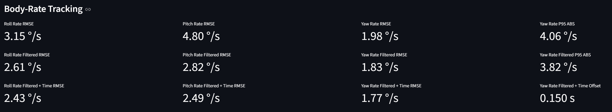

### Body-rate setpoint vs actual

The selected body-rate axis plot compares:

- raw rate setpoint
- measured body rate
- raw time-compensated rate setpoint
- detected flight-phase background bands

The selectable axes are:

- roll
- pitch
- yaw

The y-axis unit is degrees per second.

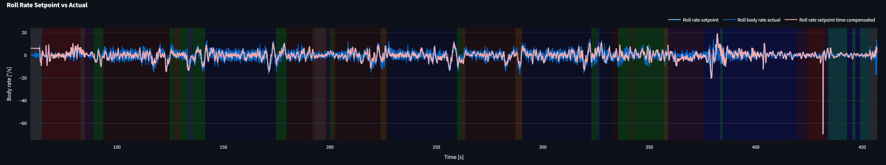

### Body-rate filtered setpoint vs actual

The filtered body-rate plot compares:

- filtered rate setpoint
- measured body rate
- filtered time-compensated rate setpoint, when available
- detected flight-phase background bands

This plot is useful for checking whether the original setpoint contains high-frequency content that dominates the raw error metric.

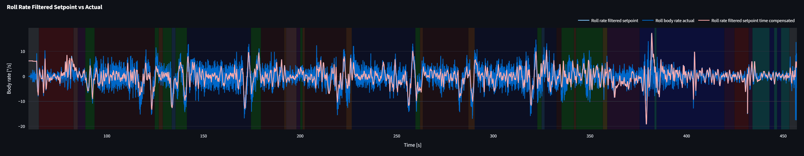

### Body-rate tracking error

The body-rate error plot shows:

- roll rate error
- pitch rate error
- yaw rate error

The error definition is:

```text
rate_error = rate_setpoint - rate_actual
```

A horizontal zero line is included so persistent positive or negative bias is easier to identify.

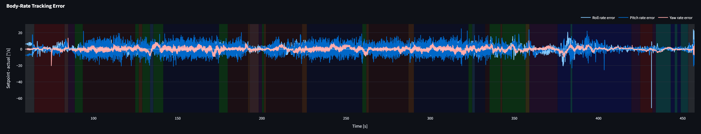

### Tracking error vs actuator effort

This plot overlays:

- body-rate error magnitude
- motor-output spread
- detected flight-phase background bands

The body-rate error magnitude is calculated from the three raw body-rate error components:

```text
rate_error_magnitude = sqrt(roll_error² + pitch_error² + yaw_error²)
```

The plot is intended as a diagnostic correlation view. High error together with high motor-output spread can indicate high control demand, but it does not prove motor saturation or an airframe defect.

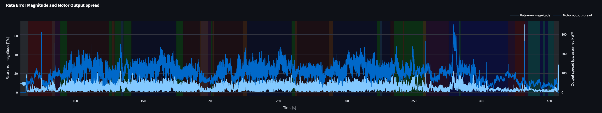

### Body-rate tracking metrics table

The body-rate metrics table reports raw, filtered, raw time-compensated, and filtered time-compensated error metrics for the available roll, pitch, and yaw rate signals.

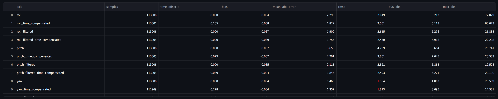

### Attitude tracking summary cards

The **Attitude Tracking** section shows metric cards for roll, pitch, and yaw attitude tracking.

Shown summary values include:

- Roll Attitude RMSE
- Pitch Attitude RMSE
- Yaw Attitude RMSE
- Roll/Pitch/Yaw Attitude Filtered RMSE
- Roll/Pitch/Yaw Attitude Filtered + Time RMSE

All values are recomputed from the selected time window.

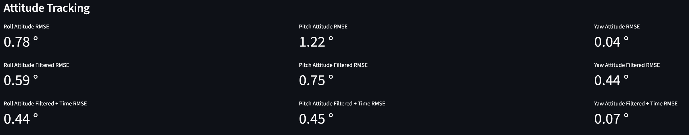

### Attitude setpoint vs actual

The selected attitude-axis plot compares:

- raw attitude setpoint
- measured attitude
- raw time-compensated attitude setpoint
- detected flight-phase background bands

The selectable axes are:

- roll
- pitch
- yaw

The y-axis unit is degrees.

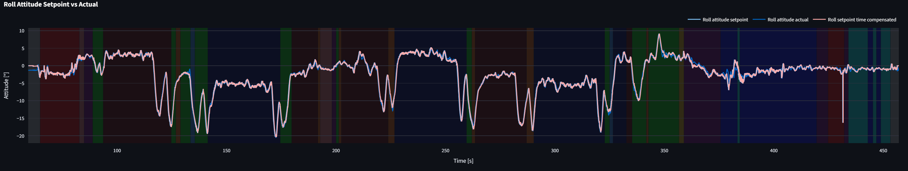

### Attitude filtered setpoint vs actual

The filtered attitude plot compares:

- filtered attitude setpoint
- measured attitude
- filtered time-compensated attitude setpoint, when available
- detected flight-phase background bands

Yaw filtering is handled with angle unwrap/wrap logic so wraparound near ±180° does not create artificial jumps in the filtered signal.

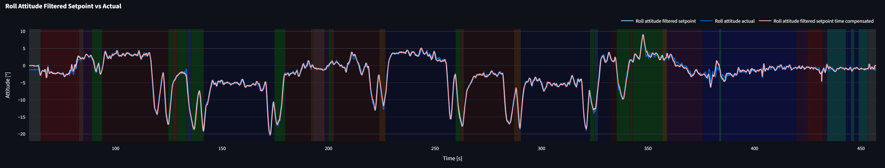

### Attitude tracking error

The attitude error plot shows:

- roll attitude error
- pitch attitude error
- yaw attitude error

The error definition is:

```text
attitude_error = attitude_setpoint - attitude_actual
```

Yaw error is wrapped to the range `[-180°, 180°]`.

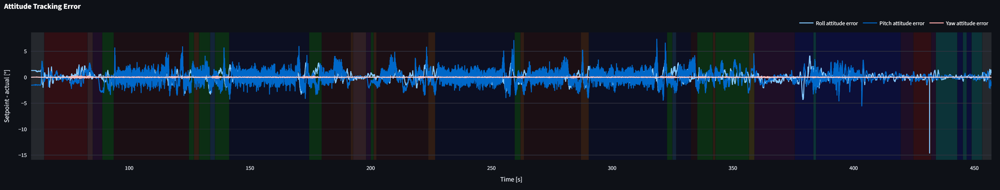

### Attitude tracking metrics table

The attitude metrics table reports raw, filtered, raw time-compensated, and filtered time-compensated error metrics for the available roll, pitch, and yaw attitude signals.

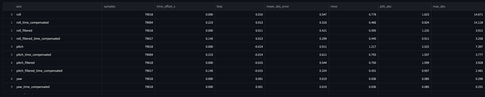

### Trajectory tracking summary cards

The **Trajectory Tracking** section shows three metric cards for the currently selected trajectory signal:

- selected signal RMSE
- selected signal filtered RMSE
- selected signal filtered + time RMSE

The available trajectory signals depend on which `trajectory_setpoint` fields are present in the log.

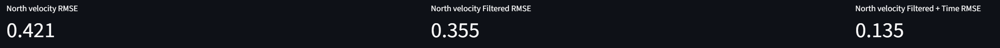

### Trajectory setpoint vs actual

The trajectory plot compares the selected raw trajectory setpoint with the measured response.

Possible displayed signals include:

- North position
- East position
- Down position
- Altitude
- North velocity
- East velocity
- Down velocity
- Vertical speed

For velocity-type trajectory signals, a raw time-compensated setpoint is also shown when available. For position-type signals, the current implementation focuses time compensation on the filtered position setpoint.

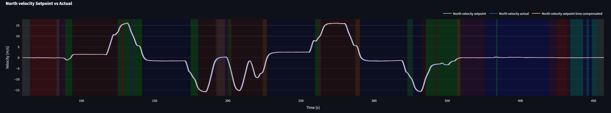

### Trajectory filtered setpoint vs actual

The filtered trajectory plot compares:

- filtered trajectory setpoint
- measured trajectory response
- filtered time-compensated setpoint, when available
- detected flight-phase background bands

This plot is especially useful for position and altitude tracking, where raw setpoints may contain discrete changes or steps.

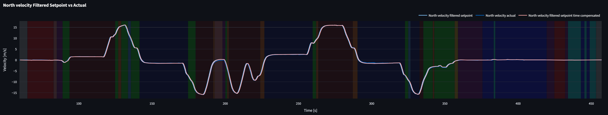

### Trajectory tracking metrics table

The trajectory metrics table reports tracking-error metrics for all available trajectory signals. Depending on available log fields, it may include rows for:

- `x_position`
- `y_position`
- `z_position`
- `altitude`
- `vx_velocity`
- `vy_velocity`
- `vz_velocity`
- `vertical_speed`
- corresponding filtered rows
- corresponding time-compensated rows where implemented

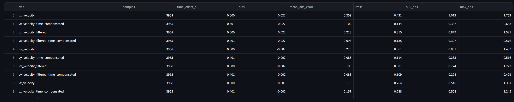

## Derived metrics and formulas

The detailed definitions for low-pass filtered setpoints, raw error, yaw wrapping, cross-correlation lag estimation, time-compensated error, and summary metrics are documented in [`methods/tracking-error-metrics.md`](../methods/tracking-error-metrics.md).

This page applies those shared definitions to three tracking groups:

| Tracking group | Main error definition |
|---|---|
| Body-rate tracking | `rate_error = rate_setpoint - rate_actual` |
| Attitude tracking | `attitude_error = attitude_setpoint - attitude_actual` |
| Trajectory tracking | `trajectory_error = trajectory_setpoint - trajectory_actual` |

For body-rate tracking, the page also calculates a compact three-axis error magnitude for comparison with actuator effort:

```text
rate_error_magnitude_deg_s = sqrt(
    roll_rate_error_deg_s² +
    pitch_rate_error_deg_s² +
    yaw_rate_error_deg_s²
)
```

This magnitude is used only as a diagnostic signal in the actuator-effort comparison. It should not replace the per-axis metrics because it hides which axis caused the error.

## Recommended workflow example

1. Select a time window with meaningful setpoint activity.
2. Check which analyses are available in the log.
3. Start with body-rate tracking because it is closest to the rate controller output.
4. Compare raw RMSE with filtered RMSE.
5. Compare filtered RMSE with filtered + time-compensated RMSE.
6. Inspect the selected-axis setpoint-vs-actual plot to see whether error is caused by offset, delay, overshoot, undershoot, or rapid setpoint changes.
7. Use the tracking-error plot to identify whether the error is transient or persistent.
8. Compare rate-error magnitude with motor-output spread to see whether poor tracking coincides with high actuator demand.
9. Repeat the same logic for attitude tracking.
10. Use trajectory tracking last, because position and velocity errors include estimator behavior, mission behavior, setpoint generation, and lower-level controller response.

## Clear limitations

### Tracking error does not prove root cause

Large tracking error can be caused by many effects, including aggressive setpoints, limited actuator authority, poor tuning, estimator delay, wind, payload shift, airframe flexibility, sensor noise, mechanical problems, or log timing issues. The page shows diagnostic indicators, not proof of cause.

### Time compensation is approximate

The lag estimate is based on cross-correlation in the selected time window. It is useful when setpoint and response have similar shapes, but it can be unreliable when signals are nearly constant, very noisy, dominated by impulses, or not causally related. See [`methods/tracking-error-metrics.md`](../methods/tracking-error-metrics.md) for the detailed lag-estimation method.

### Filtered setpoints are diagnostic only

The filtered setpoints are created by the analysis tool. They are not necessarily the setpoints used internally by the PX4 controller. They are useful for separating high-frequency command content from lower-frequency tracking performance.

### Position and velocity tracking are more indirect than rate tracking

Trajectory tracking includes setpoint generation, estimator behavior, position-control behavior, velocity-control behavior, attitude-control behavior, and actuator response. Therefore, trajectory error is less direct evidence of controller quality than body-rate error.

### Nearest-neighbor topic alignment can introduce small timing errors

The page uses nearest-neighbor style topic alignment for several comparisons. This is usually adequate for dashboard screening, but it is not equivalent to a fully synchronized control-loop reconstruction.

### Motor-output spread is not the same as actuator saturation

High motor-output spread means the active motor outputs differ strongly from each other. It does not prove saturation. To prove saturation, the actual configured actuator limits, mixer behavior, motor mapping, and airframe geometry would need to be known.

### Phase labels are derived, not ground truth

The colored phase backgrounds come from rule-based phase classification. Misclassification can affect visual interpretation of when tracking errors occur.
