# Vibration Analysis Page Methodology

## Page intent

The **Vibration Analysis** page is used to screen a PX4 `.ulg` flight log for IMU vibration, clipping, vibration-frequency content, and possible correlation between vibration and actuator demand.

The page answers the following questions:

- Are PX4 accelerometer or gyroscope vibration metrics elevated in the log?
- Did accelerometer or gyroscope clipping occur?
- Which accelerometer frequency dominates the full-log spectrum?
- How do accelerometer and gyroscope vibration signals change over time?
- How does frequency content change over the selected time window?
- Which flight phase has the strongest vibration indicators?
- Does vibration appear related to mean motor output, motor-output spread, actuator-control frequency content, or clipping events?
- Which flight phases contain the highest RMS vibration, crest factor, dominant frequency, band power, or clipping count?

The page is designed for **vibration screening and correlation analysis**. It can identify suspicious time windows, flight phases, frequencies, and actuator-demand conditions. It should not be interpreted as a final proof of root cause. High vibration may come from propellers, motors, frame resonance, mounting, flight maneuvering, controller behavior, estimator effects, sensor noise, logging artifacts, or a combination of several factors.

## Required and optional PX4 ULog topics

### `vehicle_imu_status`

This is the primary required topic for the Vibration Analysis page. If this topic is unavailable, the vibration health overview cannot be calculated.

Fields used when available:

- `timestamp`
- `accel_vibration_metric`
- `gyro_vibration_metric`
- `accel_clipping` or `delta_velocity_clipping`
- `gyro_clipping` or `delta_angle_clipping`

The implementation supports scalar fields and PX4-style array-expanded fields. If multiple matching fields are found, the vibration metric is normalized into one dashboard column.

### `vehicle_local_position`

This topic is required for the common time range, detected flight phases, phase-background coloring, per-phase vibration statistics, and worst-phase context.

Required fields:

- `timestamp`
- `x`
- `y`
- `z`
- `vx`
- `vy`
- `vz`

The page uses the processed dataframe returned by `flight.position`. This dataframe already contains derived local-position signals and detected flight phases.

### `sensor_combined`

This is the preferred source for high-rate accelerometer and gyroscope signals used by the Vibration Analysis page.

For acceleration, the implementation first looks for:

- `raw_accelerometer_m_s2[0]`
- `raw_accelerometer_m_s2[1]`
- `raw_accelerometer_m_s2[2]`

If raw accelerometer fields are unavailable, it falls back to:

- `accelerometer_m_s2[0]`
- `accelerometer_m_s2[1]`
- `accelerometer_m_s2[2]`

For gyroscope data, the implementation looks for:

- `gyro_rad[0]`
- `gyro_rad[1]`
- `gyro_rad[2]`

This preference is important because many PX4 logs store the standalone `sensor_accel` and `sensor_gyro` topics at a low diagnostic rate, while `sensor_combined` contains the high-rate IMU stream that is more useful for vibration-frequency analysis.

### `sensor_accel`

This topic is used as a fallback source for accelerometer data if `sensor_combined` is unavailable or does not contain usable accelerometer fields.

Supported fallback axis field patterns include:

- `x`, `y`, `z`
- `xyz[0]`, `xyz[1]`, `xyz[2]`
- `accel[0]`, `accel[1]`, `accel[2]`
- `acceleration[0]`, `acceleration[1]`, `acceleration[2]`
- `accelerometer_m_s2[0]`, `accelerometer_m_s2[1]`, `accelerometer_m_s2[2]`
- `accel_x_m_s2`, `accel_y_m_s2`, `accel_z_m_s2`

The normalized dashboard columns are always:

- `accel_x_m_s2`
- `accel_y_m_s2`
- `accel_z_m_s2`
- `accel_magnitude_m_s2`

### `sensor_gyro`

This topic is used as a fallback source for gyroscope data if `sensor_combined` is unavailable or does not contain usable gyroscope fields.

Supported fallback axis field patterns include:

- `x`, `y`, `z`
- `xyz[0]`, `xyz[1]`, `xyz[2]`
- `gyro[0]`, `gyro[1]`, `gyro[2]`
- `angular_velocity[0]`, `angular_velocity[1]`, `angular_velocity[2]`
- `angular_velocity_rad_s[0]`, `angular_velocity_rad_s[1]`, `angular_velocity_rad_s[2]`
- `angular_rate[0]`, `angular_rate[1]`, `angular_rate[2]`
- `gyro_x_rad_s`, `gyro_y_rad_s`, `gyro_z_rad_s`
- `gyro_rad[0]`, `gyro_rad[1]`, `gyro_rad[2]`

The normalized dashboard columns are always:

- `gyro_x_rad_s`
- `gyro_y_rad_s`
- `gyro_z_rad_s`
- `gyro_magnitude_rad_s`

### `actuator_outputs`

This topic is optional for the page, but required for actuator-correlation scatter plots and the clipping-events-versus-motor-limits overlay.

Fields used when available:

- `timestamp`
- active actuator output columns such as `output[0]`, `output[1]`, ...

The page uses the same processed actuator-output dataframe as the Actuator Output Analysis page, including:

- `mean_motor_output`
- `min_motor_output`
- `max_motor_output`
- `motor_output_spread`

### `actuator_controls`, `actuator_controls_0`, or related actuator-controls topics

This topic is optional and is used for actuator-control FFT analysis and frequency-content comparison with acceleration.

The implementation searches for actuator-control topic variants and active control-vector columns. Normalized control columns are named:

- `control_0`
- `control_1`
- `control_2`
- ...

## Time base

For the full shared method, see [`methods/time-base.md`](../methods/time-base.md).

All displayed signals use the relative time column:

```text
time_s = (timestamp - log_start_timestamp) / 1e6
```

The sidebar time-range slider filters the vibration, local-position, accelerometer, gyroscope, actuator-controls, and actuator-output dataframes:

```text
selected rows = rows where selected_start_s <= time_s <= selected_end_s
```

The phase-background bands are generated from the selected `vehicle_local_position` interval. This means the colored phase backgrounds always correspond to the currently selected time window.

## Sidebar controls

The page includes one main time-window control and a PSD / FFT settings expander.

### Displayed time range

The **Displayed time range [s]** slider controls which part of the log is shown in the detailed plots and selected-window calculations.

### PSD / FFT settings

The **PSD / FFT settings** expander controls:

- `PSD window duration [s]`
- `PSD update interval [s]`
- `PSD heatmap max frequency [Hz]`
- `Display PSD heatmap in dB`
- `Use relative dB scale`
- `PSD heatmap dB display range`
- `Actuator FFT max frequency [Hz]`
- `Per-phase band power lower frequency [Hz]`
- `Per-phase band power upper frequency [Hz]`

The default PSD window duration is `1.0 s`. The default PSD update interval is `1.0 s`. This means the heatmap uses approximately one PSD estimate per second, with each estimate calculated from approximately one second of signal data.

By default, the heatmaps are displayed in relative dB with a `-100 dB` to `0 dB` display range. The PSD calculation itself remains in linear physical units; the dB transform is applied only to the heatmap color values so weaker spectral components remain visible. For the detailed frequency-domain methodology, see [`methods/fft-psd-analysis.md`](../methods/fft-psd-analysis.md).

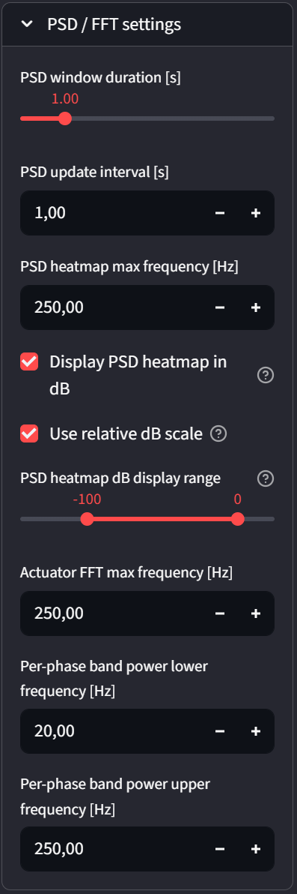

## Signals shown on the page

### Vibration health overview

The top metric cards summarize the full-log vibration health overview:

- Max accel vibration metric
- Max gyro vibration metric
- Total accel clipping
- Total gyro clipping
- Dominant accel frequency
- accelerometer sample rate
- accelerometer FFT samples
- Worst flight phase

These values are calculated from the full cached vibration analysis result. The selected time range affects the detailed plots and selected-window calculations below, but the overview cards are not recomputed only from the selected time range in the current implementation.

The source label shown in the UI may still say `sensor_accel` for historical readability, but the actual accelerometer source can now be `sensor_combined` or `sensor_accel` depending on the log. The source-field expander should be checked when interpreting the sample rate and FFT axes.

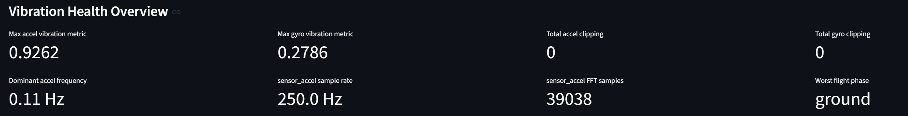

### Source fields table

The **Show source fields used for the health overview** expander lists which fields were used for:

- accelerometer vibration metric
- gyroscope vibration metric
- accelerometer clipping
- gyroscope clipping
- accelerometer FFT axes
- accelerometer time-domain axes
- gyroscope time-domain axes
- actuator-controls FFT fields

This table is important because PX4 logs may use different field names, array-expanded schemas, or different high-rate sensor source topics.

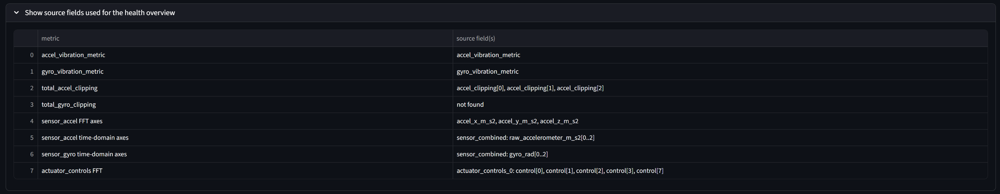

### Accel vibration metric vs mean motor output

This actuator-correlation scatter plot compares:

- x-axis: `mean_motor_output`
- y-axis: `accel_vibration_metric`
- optional color: detected `flight_phase`

The data is time-aligned by nearest-time merging vibration samples with actuator-output samples inside the selected time range.

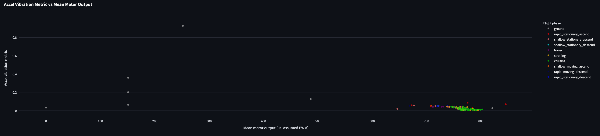

### Gyro vibration metric vs motor output spread

This actuator-correlation scatter plot compares:

- x-axis: `motor_output_spread`
- y-axis: `gyro_vibration_metric`
- optional color: detected `flight_phase`

It helps screen whether gyroscope vibration increases when the controller commands a larger spread between active motor outputs.

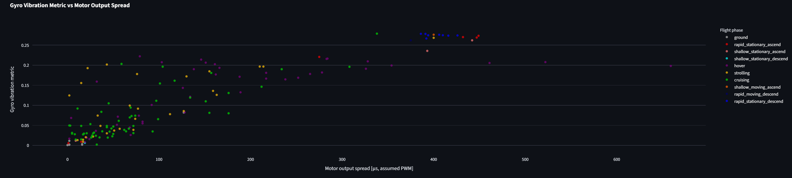

### Dominant frequency vs actuator-control frequency content

This plot compares selected-window frequency content from:

- actuator-control FFT amplitude
- accelerometer FFT amplitude

It also marks the selected-window accelerometer dominant frequency and actuator-control dominant frequency when they are available.

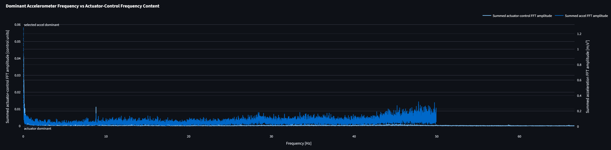

### Clipping events overlaid with motor limits

This plot overlays:

- maximum motor output
- mean motor output
- minimum motor output
- cumulative accelerometer clipping count
- cumulative gyroscope clipping count
- markers for clipping-count increments
- observed upper and lower motor-output limits in the selected time range

The motor limits shown here are observed min/max values from the selected time range. They are not necessarily parameter-based PWM limits.

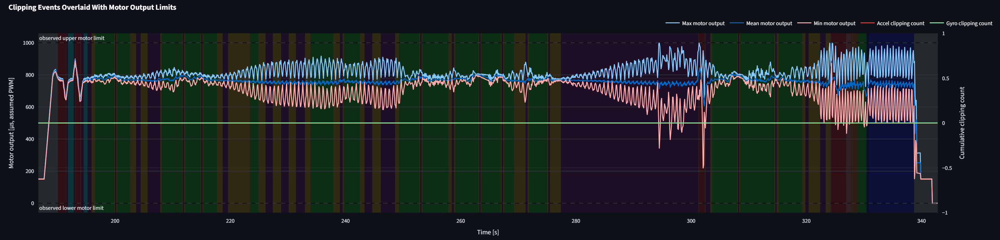

### Per-phase vibration table

The per-phase table summarizes the selected time range by detected flight phase. It shows:

- phase duration
- position, accelerometer, and gyroscope sample counts
- accelerometer RMS for x/y/z
- accelerometer vector RMS
- gyroscope RMS for x/y/z
- gyroscope vector RMS
- P95 accelerometer magnitude
- P95 gyroscope magnitude
- accelerometer crest factor
- gyroscope crest factor
- accelerometer clipping count
- gyroscope clipping count
- total clipping count
- accelerometer dominant frequency
- gyroscope dominant frequency
- accelerometer band power
- gyroscope band power

RMS, P95 magnitude, crest factor, dominant frequency, and band power are calculated from mean-centered sensor signals so the values emphasize vibration rather than static offset or gravity.

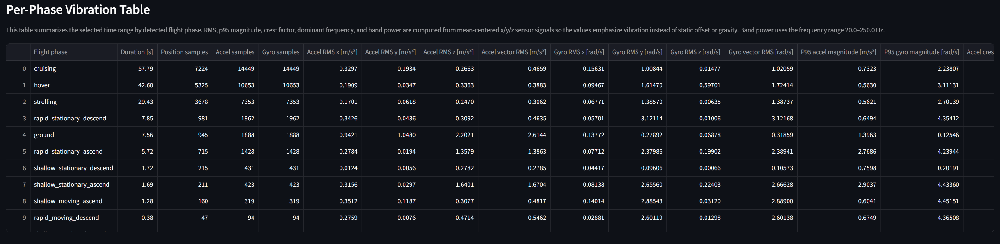

### Accelerometer acceleration over time

This time-domain plot shows the normalized accelerometer source selected by the implementation:

- `accel_x_m_s2`
- `accel_y_m_s2`
- `accel_z_m_s2`
- `accel_magnitude_m_s2`

The data usually comes from `sensor_combined` when available, with `sensor_accel` used as a fallback. Detected flight phases are shown as background coloring.

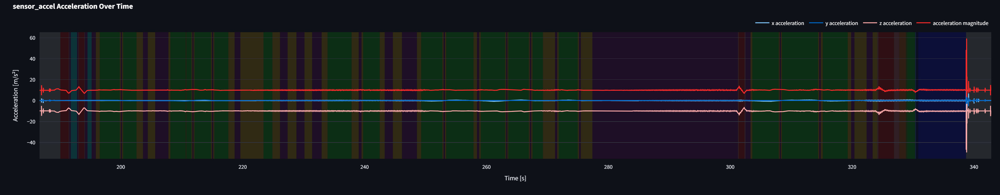

### Gyroscope angular velocity over time

This time-domain plot shows the normalized gyroscope source selected by the implementation:

- `gyro_x_rad_s`
- `gyro_y_rad_s`
- `gyro_z_rad_s`
- `gyro_magnitude_rad_s`

The data usually comes from `sensor_combined` when available, with `sensor_gyro` used as a fallback. Detected flight phases are shown as background coloring.

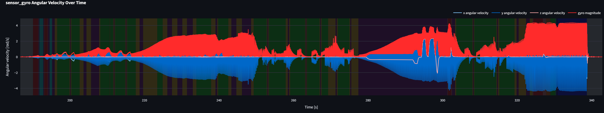

### `vehicle_imu_status` clipping counters over time

This plot shows normalized cumulative clipping counters:

- `accel_clipping_count`
- `gyro_clipping_count`

Detected flight phases are shown as background coloring.

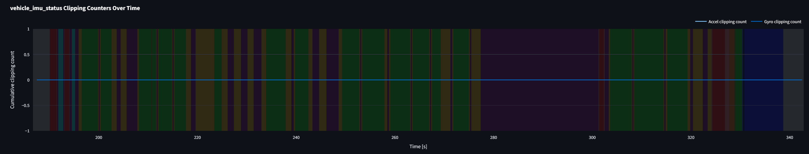

### `vehicle_imu_status` vibration metrics over time

This plot shows:

- `accel_vibration_metric`
- `gyro_vibration_metric`

The two signals are plotted on separate y-axes because their numeric scale may differ.

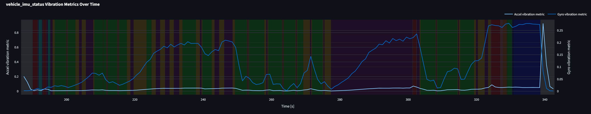

### Accelerometer time-resolved PSD heatmap

This heatmap shows how accelerometer frequency content changes over time.

- x-axis: frequency in Hz
- y-axis: time in seconds
- color: linear PSD or dB-transformed PSD, depending on sidebar display settings

The user can choose the displayed accelerometer signal from the available normalized accelerometer columns. By default, the heatmap uses relative dB display, so the brightest value in the selected heatmap is `0 dB` and weaker content appears as negative dB values.

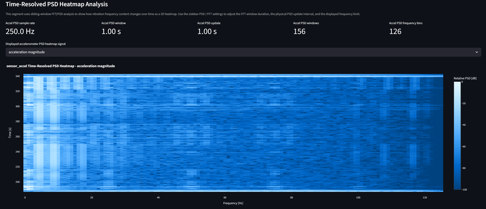

### Gyroscope time-resolved PSD heatmap

This heatmap shows how gyroscope frequency content changes over time.

- x-axis: frequency in Hz
- y-axis: time in seconds
- color: linear PSD or dB-transformed PSD, depending on sidebar display settings

The user can choose the displayed gyroscope signal from the available normalized gyroscope columns. By default, the heatmap uses relative dB display, so color represents relative spectral strength within that heatmap rather than absolute vibration energy across different plots.

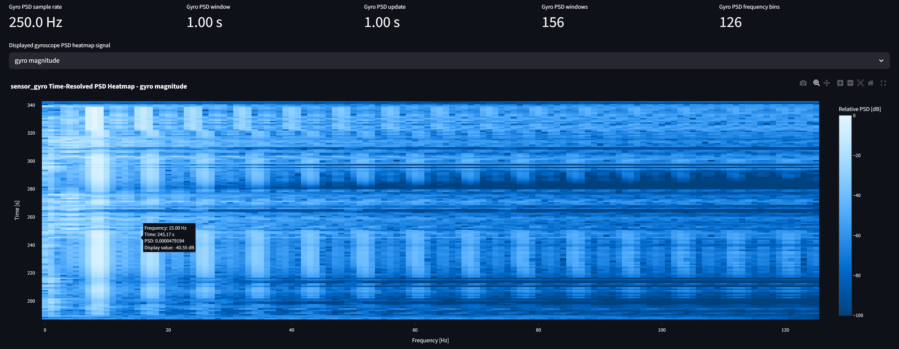

### Actuator controls FFT

This plot shows the single-sided FFT amplitude spectrum for the active actuator-control channels found in the log. The DC component is hidden so command-frequency content is easier to compare.

The page also shows:

- actuator FFT sample rate
- actuator FFT samples
- actuator FFT channels

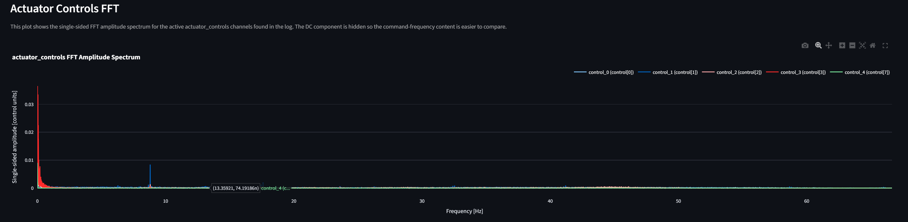

### Acceleration frequency content

This plot shows the full-log summed accelerometer PSD from the selected accelerometer source. A vertical line marks the dominant accelerometer frequency when available.

The displayed frequency range can be adjusted with the **Displayed PSD frequency range [Hz]** slider.

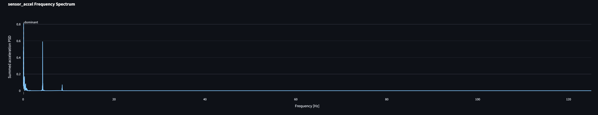

### Worst flight phase table

The worst-flight-phase table summarizes the phase-based vibration statistics used to select the worst phase:

- flight phase
- worst-phase flag
- samples
- maximum accelerometer vibration metric
- maximum gyroscope vibration metric
- mean accelerometer vibration metric
- mean gyroscope vibration metric
- combined vibration score

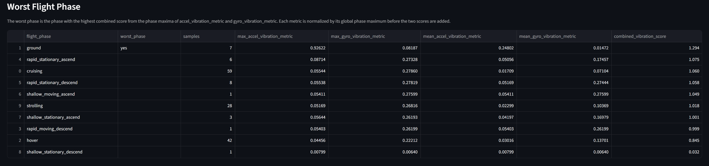

## Derived signals and formulas

### Normalized vibration metrics

The page normalizes the `vehicle_imu_status` vibration fields into the dashboard columns:

```text
accel_vibration_metric
gyro_vibration_metric
```

If a field appears as an array-expanded signal, multiple matching columns can be combined. The current implementation uses the maximum across matching vibration-metric fields.

### Cumulative clipping counters

The page supports several possible clipping-field names:

```text
accelerometer clipping candidates = accel_clipping, delta_velocity_clipping
gyroscope clipping candidates     = gyro_clipping, delta_angle_clipping
```

A normalized cumulative counter is created for each sensor type:

```text
accel_clipping_count
gyro_clipping_count
```

Counter-like signals are interpreted by summing positive increments. Event-like signals are summed directly. This makes the visualization robust to logs where clipping fields are stored differently.

### Accelerometer and gyroscope magnitude

After finding usable x/y/z sensor axes, the page calculates vector magnitude:

```text
accel_magnitude_m_s2 = sqrt(accel_x_m_s2² + accel_y_m_s2² + accel_z_m_s2²)

gyro_magnitude_rad_s = sqrt(gyro_x_rad_s² + gyro_y_rad_s² + gyro_z_rad_s²)
```

### Sensor source metadata

The normalized sensor dataframes include source-description columns:

```text
sensor_accel_axis_columns
sensor_gyro_axis_columns
```

These columns should be checked when interpreting spectral results. They may report `sensor_combined` even though some UI labels use `sensor_accel` / `sensor_gyro` naming.

### Frequency-domain analysis

For the full shared method, see [`methods/fft-psd-analysis.md`](../methods/fft-psd-analysis.md).

The Vibration Analysis page uses the shared FFT/PSD method for:

- full-log accelerometer PSD
- dominant accelerometer frequency detection
- selected-window accelerometer FFT comparison
- selected-window actuator-controls FFT
- time-resolved accelerometer PSD heatmaps
- time-resolved gyroscope PSD heatmaps
- optional linear or dB heatmap display
- per-phase accelerometer dominant frequency
- per-phase gyroscope dominant frequency
- per-phase accelerometer band power
- per-phase gyroscope band power

The method includes high-rate sensor-source selection, uniform resampling, mean removal, Hann windowing, one-sided FFT calculation, PSD scaling, dominant-frequency detection with the DC bin excluded, sliding-window PSD heatmaps, optional dB display scaling, and frequency-band power integration. The page-specific interpretation is that these spectra identify suspicious frequency content and correlation patterns; they do not prove the physical root cause of vibration.

### PSD heatmap dB display

The PSD heatmap can be displayed in linear units or dB. The dB conversion is a visualization transform only:

```text
PSD_dB = 10 * log10(PSD / reference_psd)   # relative dB mode
```

When relative dB mode is active, `reference_psd` is the maximum finite positive PSD value in the displayed heatmap. The strongest value is therefore `0 dB`, and weaker components appear as negative dB values. The dB display range clips the color scale but does not change the underlying PSD values.

### Per-phase RMS metrics

For per-phase vibration statistics, x/y/z signals are mean-centered before calculating RMS:

```text
centered_axis = axis_signal - mean(axis_signal)
rms = sqrt(mean(centered_axis²))
```

This removes static offsets, including the gravity contribution in accelerometer data, so the table emphasizes vibration-like variation.

### Per-phase vector RMS

For each sample, a centered vector magnitude is calculated from the three centered axes:

```text
centered_vector_magnitude = sqrt(centered_x² + centered_y² + centered_z²)
```

Vector RMS is then calculated from this centered vector magnitude.

### P95 magnitude

The 95th percentile magnitude is calculated from the centered vector magnitude:

```text
p95_magnitude = 95th percentile of centered_vector_magnitude
```

This gives a robust high-vibration indicator that is less sensitive to a single extreme sample than the maximum.

### Crest factor

Crest factor compares the peak centered magnitude to the RMS magnitude:

```text
crest_factor = max(centered_vector_magnitude) / vector_rms
```

A high crest factor suggests impulsive or peak-heavy behavior.

### Band power

Per-phase band power integrates PSD over the selected frequency range. For the detailed integration method and interpretation limits, see [`methods/fft-psd-analysis.md`](../methods/fft-psd-analysis.md).

### Worst flight phase score

The worst flight phase is selected from the phase-based vibration statistics. The score combines normalized phase maxima of accelerometer and gyroscope vibration metrics:

```text
accel_component = phase_max_accel_vibration_metric / global_phase_max_accel_vibration_metric

gyro_component = phase_max_gyro_vibration_metric / global_phase_max_gyro_vibration_metric

combined_vibration_score = accel_component + gyro_component
```

The phase with the highest combined vibration score is marked as the worst phase.

## What can be analyzed with this page

The Vibration Analysis page is suitable for:

- identifying whether IMU vibration metrics are high relative to the rest of the log
- detecting accelerometer or gyroscope clipping events
- finding the dominant acceleration frequency in the log
- locating time windows with high raw acceleration or angular-rate oscillation
- checking whether vibration frequency content changes during specific flight phases
- comparing per-phase vibration severity
- comparing vibration behavior against actuator demand
- checking whether clipping events occur near observed high or low motor-output values
- selecting time windows for deeper actuator, hover, or setpoint-tracking analysis

Examples of useful observations:

- A strong, persistent frequency peak may indicate a mechanical or structural vibration mode.
- Vibration that increases with mean motor output may suggest thrust-dependent vibration, but it does not prove the motor or propeller is the root cause.
- Gyro vibration that increases with motor-output spread may indicate vibration during aggressive control effort, but it can also be caused by maneuvering.
- Clipping events during high vibration should be treated seriously because clipped IMU data can affect estimator and controller quality.
- A single worst flight phase may help narrow the investigation to hover, climb, descent, cruise, or transition behavior.

## Recommended workflow example

1. Upload the PX4 `.ulg` file and open the **Vibration Analysis** page.
2. Check the **Vibration Health Overview** for maximum vibration metrics, clipping totals, dominant acceleration frequency, and worst flight phase.
3. Open the source-field expander to verify whether the spectral analysis uses `sensor_combined` or a fallback sensor topic.
4. Use the time-range slider to isolate the maneuver, hover segment, climb, descent, or suspicious interval.
5. Inspect the normalized accelerometer and gyroscope time-domain plots.
6. Check the clipping-counter plot for any increases in accelerometer or gyroscope clipping.
7. Inspect the vibration-metric plot to see when the logged vibration indicators rise.
8. Use the time-resolved PSD heatmaps to see whether vibration frequencies are stable, intermittent, or phase-dependent.
9. Adjust the PSD heatmap dB controls if one strong peak or impulse hides weaker frequency content.
10. Inspect the actuator-controls FFT and frequency-comparison plot to see whether command-frequency content overlaps with acceleration-frequency content.
11. Check actuator-correlation scatter plots to see whether vibration rises with mean motor output or motor-output spread.
12. Review the clipping-events-versus-motor-limits plot if clipping occurred.
13. Use the per-phase vibration table to compare vibration severity across detected flight phases.
14. Use the worst-flight-phase table to identify which phase deserves deeper inspection.
15. Continue with related pages:
    - **Actuator Output Analysis** if vibration appears linked to actuator demand.
    - **Hover Analysis** if vibration or clipping occurs during hover.
    - **Setpoint Tracking Analysis** if vibration coincides with tracking degradation.
    - **Flight Phase Detection Test** if the phase classification looks suspicious.

## Clear limitations

### The page is correlation-oriented, not causal

The page can show that vibration, actuator demand, clipping, and flight phase occur together. It cannot prove that one caused the other. Causal conclusions require airframe geometry, motor mapping, propeller condition, sensor mounting information, controller configuration, estimator status, environmental context, and ideally controlled comparison tests.

### Vibration metrics are PX4-derived indicators

`accel_vibration_metric` and `gyro_vibration_metric` are logged health indicators. They are useful for screening, but their exact interpretation depends on the PX4 version, IMU pipeline, estimator configuration, and logging schema.

### Clipping fields may differ between logs

The implementation tries to handle both counter-like and event-like clipping fields. This makes the page more robust, but it also means clipping counts should be interpreted as a practical estimate unless the exact log schema is known.

### Sensor source selection affects interpretation

The page prefers high-rate `sensor_combined` data for accelerometer and gyroscope vibration analysis. This is usually better for spectral work, but UI labels that say `sensor_accel` / `sensor_gyro` should be interpreted as normalized dashboard signal names, not necessarily the original source topic. Always check the source-field table.

### Frequency analysis depends on sampling quality

FFT and PSD analysis require a usable time base, sufficient samples, finite data, and approximately stable sampling after interpolation. Irregular timestamps, missing data, short selected windows, or strong transients can distort frequency estimates.

### Dominant frequency is not automatically a root cause

A dominant frequency peak identifies a strong spectral component. It does not prove whether the source is a propeller, motor, frame resonance, controller oscillation, external disturbance, or sensor artifact.

### dB heatmap display is relative by default

The default relative dB heatmap is useful for seeing weak frequency content, but it normalizes each heatmap to its own maximum. This means color intensity is not an absolute vibration-energy comparison between different heatmaps or different selected signals.

### Time-resolved PSD settings affect interpretation

A longer PSD window improves frequency resolution but reduces time localization. A shorter window improves time localization but makes frequency estimates coarser. The PSD update interval changes how often PSD rows are calculated, not the physical window length.

### Per-phase spectral statistics depend on phase segmentation

Per-phase vibration metrics depend on the detected flight phases and nearest-time phase assignment. If the phase classification is wrong or a phase contains multiple disconnected segments, the per-phase metrics may be misleading.

### Band power depends on the selected frequency band

The default per-phase band-power range is useful for screening, but it is not universally correct for every vehicle. A meaningful band should ideally be selected based on sample rate, expected motor/propeller frequencies, structural resonance frequencies, and known sensor bandwidth.

### Actuator output units are assumed, not guaranteed

Plots involving `actuator_outputs` use motor-output values as PWM-equivalent microseconds in the labels. This is a practical convention, not proof that the values are physical PWM. The meaning depends on PX4 version, output driver, mixer/control allocation, and vehicle configuration.

### Observed motor limits are not configured limits

The clipping-events plot uses observed minimum and maximum actuator-output values in the selected range. These are not necessarily configured PWM min/max limits or true actuator saturation limits.

### Acceleration magnitude includes static and dynamic components in time-domain plots

The raw time-domain accelerometer magnitude includes gravity, sensor bias, and dynamic acceleration. Mean-centering is used for per-phase vibration metrics, but the time-domain plot itself shows the normalized raw signal magnitude.

### Public logs may lack mission and vehicle context

If the log comes from a public source or another operator, the vehicle type, motor mapping, propeller condition, IMU mounting, mission goal, payload, wind, and tuning may be unknown. Conclusions should stay conservative and descriptive.
